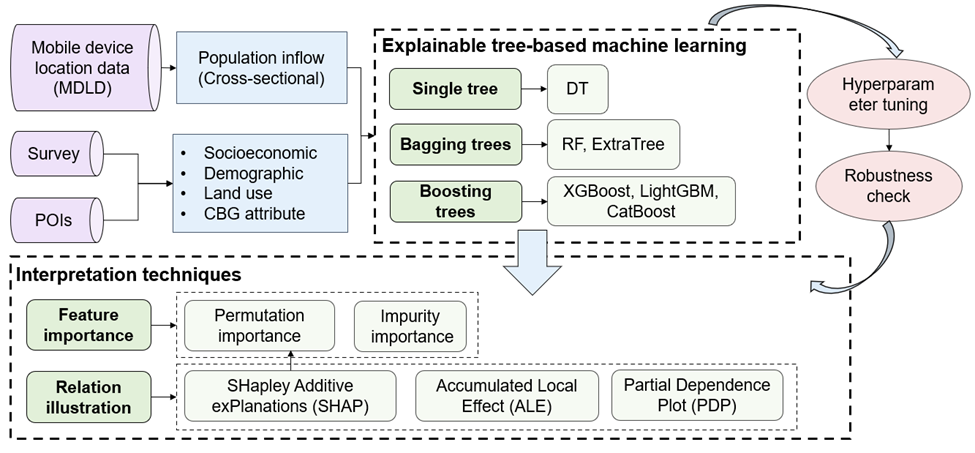
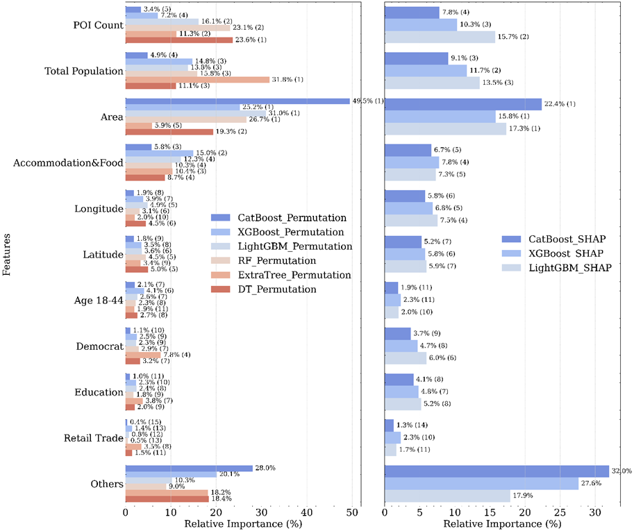
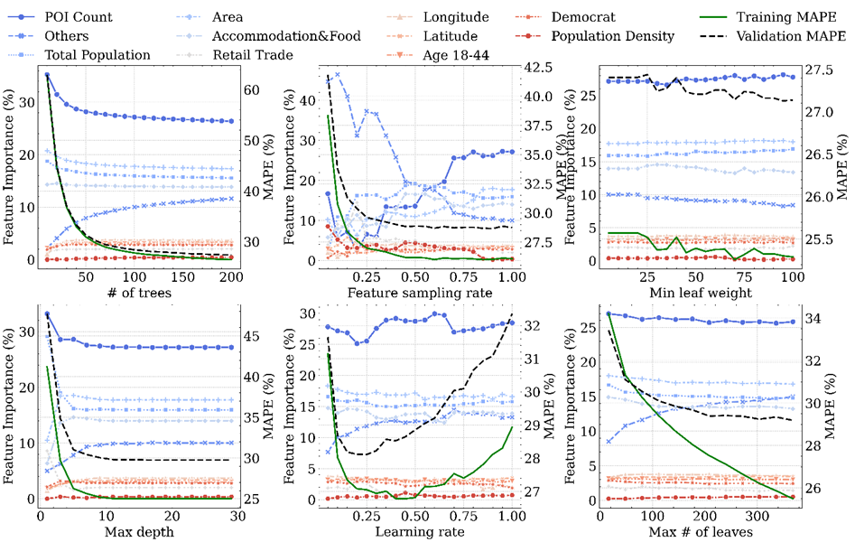
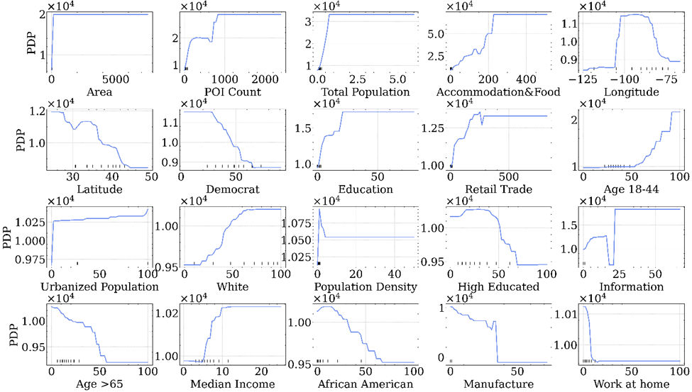
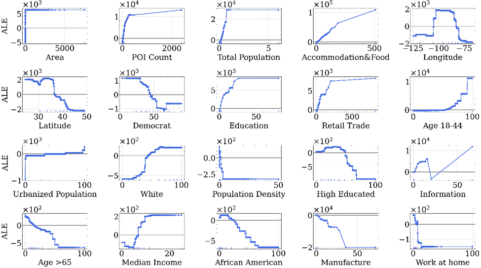
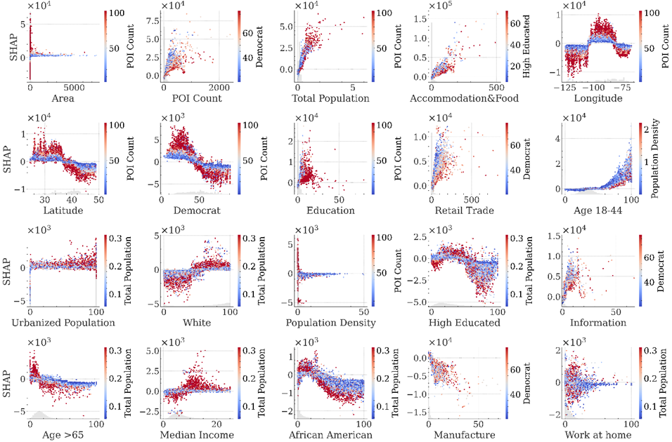

# Revisiting travel demand using big data: an empirical comparison of explainable machine learning models

#### Songhua Hu, Chenfeng Xiong, Peng Chen, Paul Schonfeld

Using the nationwide census block group (CBG)-level population inflow derived from Mobile device location data (MDLD) as the proxy of travel demand, 
this study examines its relations with various factors including socioeconomics, demographics, land use, and CBG attributes. 
A host of tree-based machine learning (ML) models and interpretation techniques (feature importance, partial dependence plot (PDP), accumulated local effect (ALE), SHapley Additive exPlanations (SHAP)) 
are extensively compared to determine the best model architecture and justify the interpretation robustness.

## Code structure
* Data used for model building is located at the folder `data`, which is computed via `State_Features.py`.
* Three R scripts are used to fit the GAM models. Our model predicts the daily average number of trips and
daily average PMT across all states.
* `Plot_Fig56.py` is used to model results plot.

## Results
#### Permutation importance of tree-based models (Shuffling vs. SHAP)

#### Sensitivity analysis of impurity importance across different hyperparameters

#### PDPs of the 20 most important features in fine-tuned LightGBM

#### ALE plots of the 20 most important features in fine-tuned LightGBM

#### SHAP interaction plots of the 20 most important features in fine-tuned LightGBM

