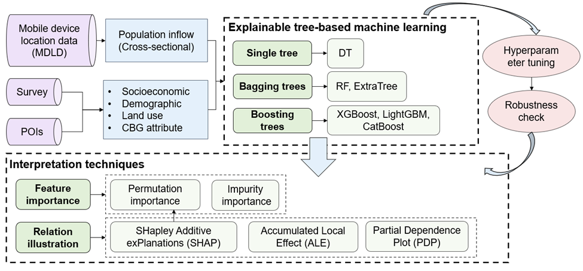
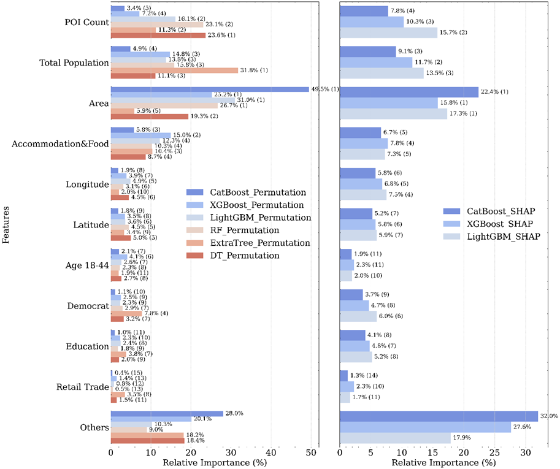
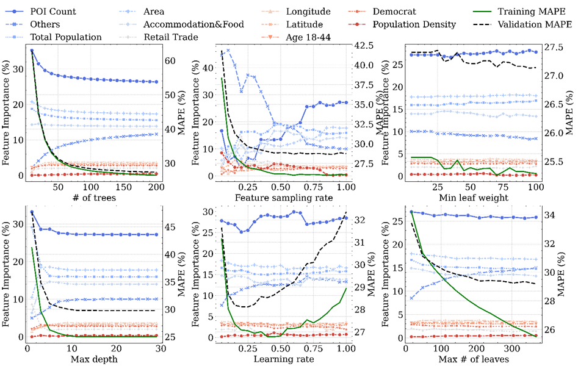
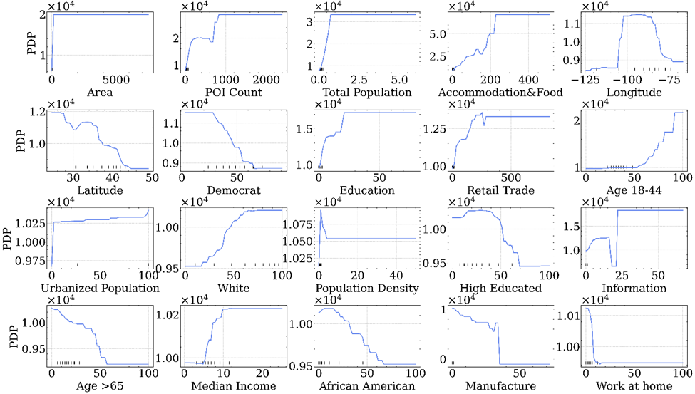
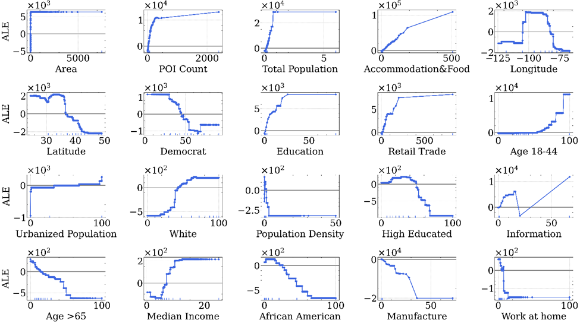
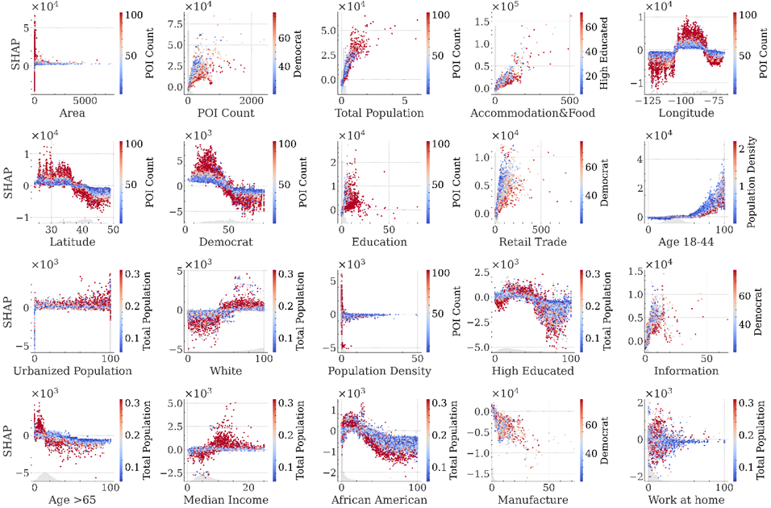

# Revisiting travel demand using big data: an empirical comparison of explainable machine learning models

#### Songhua Hu, Chenfeng Xiong, Peng Chen, Paul Schonfeld

Using the nationwide census block group (CBG)-level population inflow derived from Mobile device location data (MDLD) as the proxy of travel demand, 
this study examines its relations with various factors including socioeconomics, demographics, land use, and CBG attributes. 
A host of tree-based machine learning (ML) models and interpretation techniques (feature importance, partial dependence plot (PDP), accumulated local effect (ALE), SHapley Additive exPlanations (SHAP)) 
are extensively compared to determine the best model architecture and justify the interpretation robustness.

## Code structure
* Data used for model building is located at the folder `data`, which is computed via `1.0-Match_CBG_POI.py`, `1.1-Read_Data.py`, `1.2-Data_EDA.py`.
* `3.0-models-origin.py`, `3.1-models-transform.py` are used for model training and tuning. The first uses the original data while the second considers the data transformation.
* `4.1-Interpret models.py` is used to interpret the trained model.

## Results
#### Permutation importance of tree-based models (Shuffling vs. SHAP)

#### Sensitivity analysis of impurity importance across different hyperparameters

#### PDPs of the 20 most important features in fine-tuned LightGBM

#### ALE plots of the 20 most important features in fine-tuned LightGBM

#### SHAP interaction plots of the 20 most important features in fine-tuned LightGBM

## Result calculation and rerun protocol

`3.1-models-transform.py` fits the feature scaler and target transformer inside each of the five CV training folds, scores inverse-transformed predictions in original target units, then saves a fresh model fitted on the full training set. New saved models include their fitted transforms (`cv_utils.FoldModel`); regenerate previous trial outputs. Test data is used only for prediction. MAPE coverage is recorded in each trial's `coverage_*.json`.

`para_rerun` in `4.1-Interpret models.py` now fits all five folds for every parameter, records fold IDs in `Results/parameter_fold_metrics.csv`, and averages feature percentages across folds. The parameter figures display fold means. Existing trained models and figures were not regenerated by this code change.
